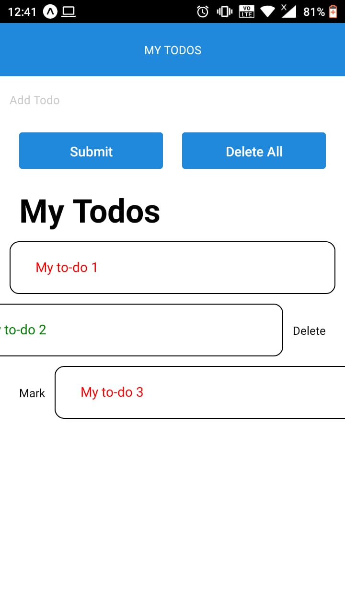

# ToDoMobX

This is a very simple tutorial on React Native using MobX

`expo init RNToDoMoBX`

`npm install @react-navigation/native @react-navigation/stack react-native-gesture-handler react-native-reanimated react-native-screens react-native-safe-area-context @react-native-community/masked-view mobx mobx-react @react-native-community/async-storage react-native-elements react-native-vector-icons react-native-swipe-item`

`npm install --save-dev @babel/plugin-proposal-decorators`

OR

`npm install`

A very simple To-do App which uses your mobile storage with swipeable list item.
It is very safe and secure. 
Very quick to perform at glance has it was developed using MobX

Also you need to check babel.config.js

